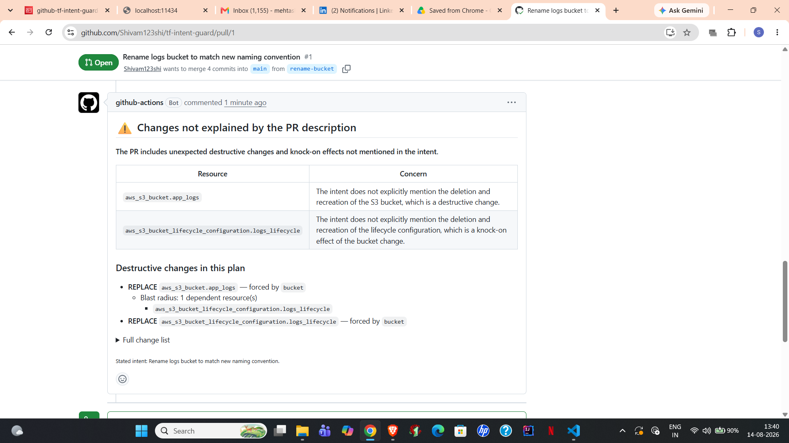

# Terraform Intent Guard

Catches Terraform changes that do more than the pull request says they do.



## The problem

A PR is titled **"rename the logs bucket to match our naming convention."** The diff is one line.

Buried in the plan, 200 lines down, that rename destroys the bucket and everything in it — because S3 bucket names are immutable, so Terraform has to delete and recreate. The reviewer skims, sees a one-line diff, and approves.

This class of bug is invisible in the diff and visible only in the plan, which nobody reads carefully.

## Why existing tools don't catch it

Checkov, tfsec, and Terrascan ask: **"is this configuration insecure?"**

They match against a fixed rulebook — don't open port 22 to the world, encrypt your buckets. A destructive change that is *correctly configured* passes every rule.

This tool asks a different question: **"does this plan match what the author said they were doing?"**

Destroying a bucket is fine if the PR says "decommission the old bucket." It is a serious problem if the PR says "rename a field." Same plan, opposite verdicts — and no rulebook can tell them apart, because the difference lives in an English sentence.

## How it works

```
PR opened
   ↓
terraform plan → JSON
   ↓
Deterministic parser  ← no LLM
   • finds delete/create (replacement)
   • extracts the attribute that forced it
   • walks the dependency graph for blast radius
   • diffs before/after to see what changed inside updates
   • flags security regressions (CIDR → 0.0.0.0/0, S3 public
     access disabled, IAM policy widened to wildcard)
   ↓
Intent check (Amazon Bedrock)  ← LLM
   • compares the PR description against the change list
   • flags anything the description doesn't explain
   ↓
Markdown comment posted on the PR
```

### The core design decision

**Facts go to code. Judgement goes to the model.**

"Is this resource being replaced?" has exactly one correct answer, sitting in a JSON field. Code reads it perfectly every time. An LLM would be right *most* of the time — not good enough for a tool whose job is preventing data loss.

"Did the author expect this?" has no field. It needs language understanding.

### Two kinds of override

The deterministic layer overrides the model in two situations:

**Destructive changes.** If the plan destroys resources but the model says "aligned," the comment shows a warning rather than a green tick.

**Security regressions.** Three checks run in pure Python and force a `diverged` verdict regardless of what the model concluded: an ingress CIDR becoming `0.0.0.0/0`, an S3 public-access protection being switched off, and an IAM policy widening to a wildcard.

These fire even when the intent declares them honestly. A wildcard IAM grant is worth a reviewer's attention whether or not the author mentioned it — the tool surfaces, the human decides.

This was added after a measured failure: the model was shown `10.0.0.0/16 => 0.0.0.0/0` in plain text and returned "aligned." Whether a CIDR is `0.0.0.0/0` is a fact sitting in the plan JSON. Asking a language model was the wrong architecture.

## Accuracy

Measured over 9 labelled scenarios, 5 runs each, on `amazon.nova-lite-v1:0`:

```
STABLE PASS  5/5  dynamodb: rename field - should warn
STABLE PASS  5/5  dynamodb: decommission table - should stay quiet
STABLE FAIL  0/5  s3: rename bucket - should warn
STABLE PASS  5/5  s3: replace bucket deliberately - should stay quiet
STABLE PASS  5/5  safe: lifecycle change - should stay quiet
STABLE PASS  5/5  smuggled: iam widening hidden behind tag change
STABLE PASS  5/5  declared: iam widening stated honestly
STABLE PASS  5/5  security: cidr opened to internet, hidden
STABLE PASS  5/5  security: cidr opened, declared honestly

Overall accuracy: 89%
Fully stable cases: 8/9
```

Cases handled by the deterministic layer have zero variance by construction. The remaining variance is entirely in the model-dependent cases.

### Known failure mode

The S3 bucket rename case fails consistently. The model reads `bucket: old-name => new-name`, sees it match the stated intent word for word, and treats the delete/create as the mechanism rather than a surprise. The equivalent DynamoDB case passes because `hash_key: a => b` doesn't look like an identity change.

Nova Pro was tested and scored **worse** (4/7 on the original suite) — it broke cases Lite handles. More expensive is not automatically better for this task.

Every case is run 5 times because verdicts on borderline cases flip between runs even at `temperature: 0`. Single-run testing produces numbers that look precise and mean nothing.

## Test case design

Each plan fixture appears twice — once with an innocent-sounding intent, once with an explicit one:

| Plan | Intent | Expected |
|---|---|---|
| bucket replaced | "rename the logs bucket" | diverged |
| bucket replaced | "delete the old bucket, logs archived" | aligned |

Identical infrastructure change, opposite correct answers. This is what distinguishes intent-checking from destruction-detection.

## Security

GitHub authenticates to AWS via **OIDC federation** — no long-lived access keys are stored anywhere in the repository or in GitHub Secrets. The workflow assumes a role scoped to this repo, with read-only permissions for S3, DynamoDB, EC2, and IAM, plus `bedrock:InvokeModel`. Credentials expire in one hour.

The workflow only ever runs `terraform plan`. It has no write permissions on any resource.

## Running locally

```bash
cd infra
terraform plan -out tfplan.binary
terraform show -json tfplan.binary > plan.json

python ../scanner/parse_plan.py plan.json "your PR description here" --real
```

Flags: `--real` calls Bedrock (omit for a stubbed response), `--markdown` writes `comment.md`, `--debug` prints the exact prompt sent to the model.

Run the eval suite:

```bash
python scanner/run_test.py --real
```

## Stack

Terraform · Python · AWS Bedrock · GitHub Actions · IAM/OIDC · boto3 · S3 remote state

## Limitations

- 9 test cases is a small sample; the 89% figure has wide error bars
- Only tested against the AWS provider
- Cascade detection occasionally still flags knock-on changes as separate findings
- The security checks cover three patterns; there are many more worth adding
- No handling for multi-module plans